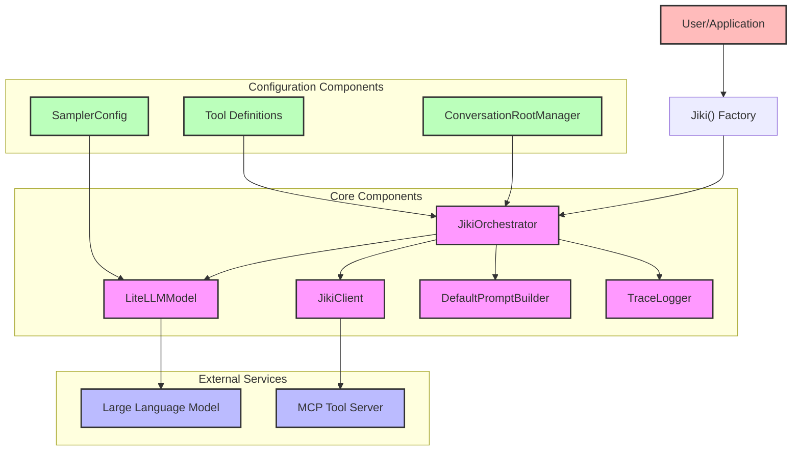
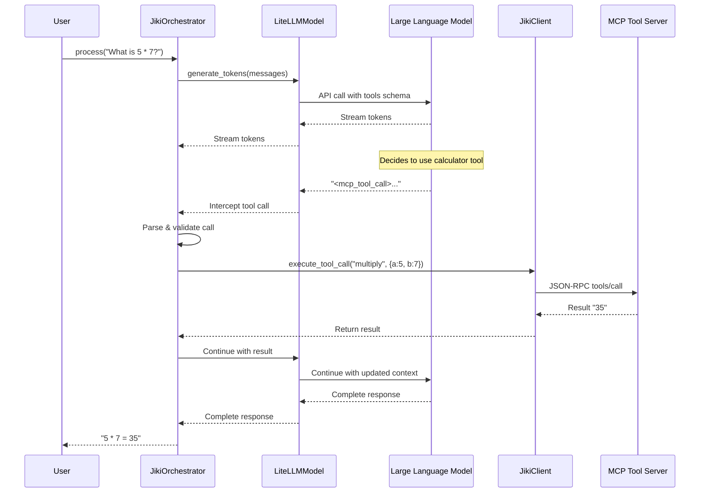
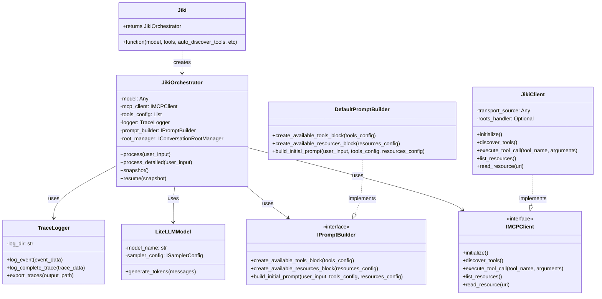
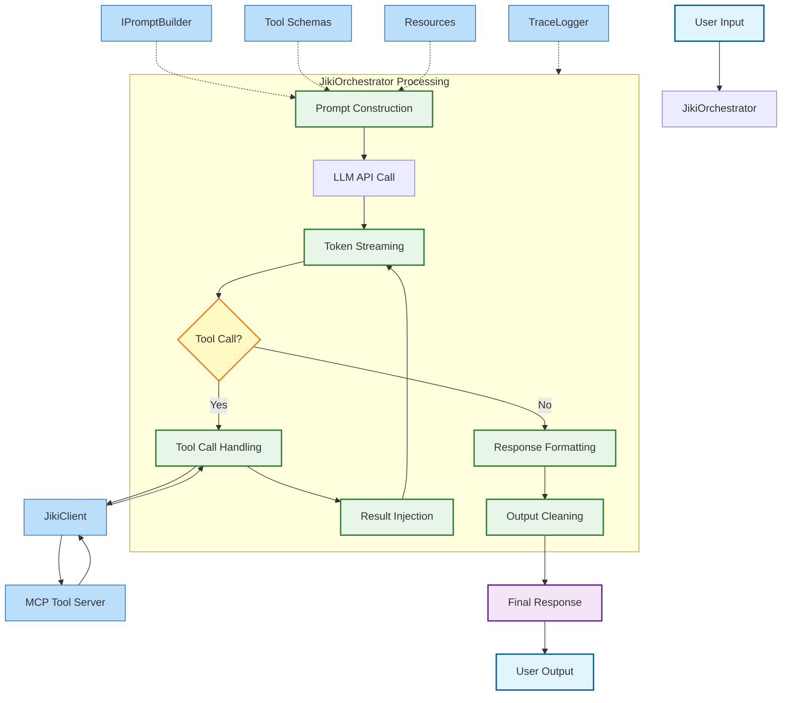

# Jiki Architecture Diagrams

## Architecture Overview

This diagram shows the high-level architecture of Jiki, with key components and their relationships.

## Tool Call Sequence

This diagram illustrates the sequence of events during a tool-augmented conversation.

## Component Relationships

This diagram shows the detailed relationships and interfaces between Jiki components.

## Data Flow Diagram

This diagram shows how data flows through the system during a typical interaction.

